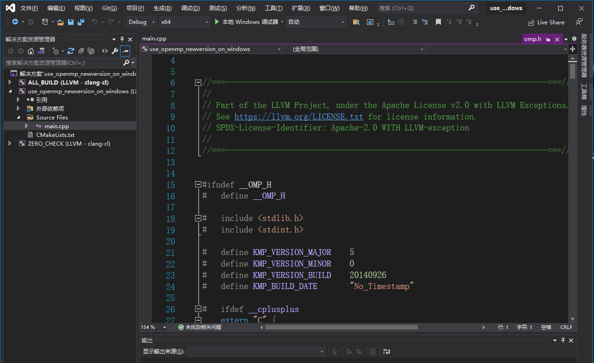

## 起因

在上一篇文章[【学习openmp-自定义reduction】](https://mangoroom.cn/parallel-programming/learn-openmp-custom-reduction.html)中介绍了复杂数据类型并行reduction的实现方法，但该方法是依赖于OpenMP3.x以上版本的declare功能实现的，而OpenMP仅提供了一个规范的标准接口，具体实现由各个编译器具体实现。各个编译器的支持情况并不一致，gcc和clang支持比较及时，现在一般都在OpenMP4.5以上，但微软的编译器就还是停留在OpenMP2.0阶段，这就导致在VS的开发环境中使用微软的编译工具链是无法使用自定义的reduction功能的。针对这一问题，文本介绍在windows平台上面使用VS开发启用OpenMP新版本的方法。

## 解决方案

既然微软的编译器不支持新版本OpenMP，那使用别的编译器不就可以了吗。答案是可以的gcc和clang都是跨平台的编译器，在windows上面都有对应的版本，笔者也测试过mingw(gcc的一个windows移植版本)是可以的。但使用gcc就意味着无法使用VS这个开发工具，在windows上面不使用VS开发c++无疑是自废武功。那有没有办法即使用非微软编译又使用VS的解决方案呢，但是也是有的，而且这个方案还是微软官方支持的，微软已经支持在VS中使用clang作为编译器开发。提供了clang编译器工具链扩展，需要开发用户自行安装。

## 安装llvm-clang扩展

打开VS，到安装界面搜索找到扩展安装。步骤路径是工具-获取工具和功能-单个组件，搜索clang，如下图，勾选安装以下llvm-clang扩展。


安装完成重启VS,至此VS已经支持使用llvm-clang的工具链编译项目。

## 编译项目

正常情况下，不作多余数据时，cmake构建生成VS解决方案的命令为：

```bash
mkdir build
cd build
cmake .. #会生成默认系统平台的VS解决方案，生成vs2017-win32或者vs2019-x64
# 或者指定vs参数
cmake -G "Visual Studio 16 2019" ..
```
构建过程
```
- Building for: Visual Studio 16 2019
//...
-- Found OpenMP_C: -openmp (found version "2.0")
-- Found OpenMP_CXX: -openmp (found version "2.0")
-- Found OpenMP: TRUE (found version "2.0")
-- Configuring done
-- Generating done
```

打开在build生成的VS解决方案，一般是这样子的：


可以看到，VS还是仅支持的老旧的OpenMP2.0版本。使用该解决方案工程编译上一篇文章[【学习openmp-自定义reduction】](https://mangoroom.cn/parallel-programming/learn-openmp-custom-reduction.html)的reduction程序时会报错：

```
error C3001: “declare”: 应为 OpenMP 指令名称
error C3036: “MyAdd”: OpenMP“reduction”子句中的运算符标记无效
error C3036: “MyAdd_with100”: OpenMP“reduction”子句中的运算符标记无效
error C3036: “MyMerge”: OpenMP“reduction”子句中的运算符标记无效
```
OpenMP2.0是不支持自定义的reduction功能的，那如何构建基于llvm-clang编译工具链的VS解决方案呢？解决方法是使用llvm-clang的编译工具链：


首先需要对CMakeLists.txt做一下修改，因为find_package搜索OpenMP在构建windows平台clang-cl项目时失效，这bug目前还是没有修好,只能通过cmake指令手动连接openmp库

```cmake
cmake_minimum_required(VERSION 3.14)

project(use_newversion_on_windows)

find_package(OpenMP)

if(OpenMP_FOUND)
    add_executable(${PROJECT_NAME} main.cpp)
    target_link_libraries(${PROJECT_NAME} OpenMP::OpenMP_CXX)
else()
    # 判断构建工程的位数
    if(CMAKE_CL_64)
        # 手动连接clang-cl编译环境的openmp库
        set(OpenMP_LIBRARY_DIR "C:/Program Files (x86)/Microsoft Visual Studio/2019/Community/VC/Tools/Llvm/x64/lib")
        set(OpenMP_CXX_FLAGS "-Xclang -fopenmp")
        set(CMAKE_CXX_FLAGS "${CMAKE_CXX_FLAGS} ${OpenMP_CXX_FLAGS}")
        link_directories(${OpenMP_LIBRARY_DIR})
        add_executable(${PROJECT_NAME} main.cpp)
        target_link_libraries(${PROJECT_NAME} PUBLIC libomp libiomp5md)
    else(CMAKE_CL_64)
        set(OpenMP_LIBRARY_DIR "C:/Program Files (x86)/Microsoft Visual Studio/2019/Community/VC/Tools/Llvm/lib")
        set(OpenMP_CXX_FLAGS "-Xclang -fopenmp")
        set(CMAKE_CXX_FLAGS "${CMAKE_CXX_FLAGS} ${OpenMP_CXX_FLAGS}")
        link_directories(${OpenMP_LIBRARY_DIR})
        add_executable(${PROJECT_NAME} main.cpp)
        target_link_libraries(${PROJECT_NAME} PUBLIC libomp libiomp5md)
    endif(CMAKE_CL_64)
endif()
```

然后在CMakeLists.txt中cmake构建VS解决方案时添加T参数

```bash
cmake -G "Visual Studio 16 2019" -T ClangCL ..
```
与默认的构建命令相比多了```-T ClangCL```命令,这个命令对应的是cmake-gui构建时的Option toolset参数设置：


构建生成过程如下：

```
- Detecting CXX compile features
-- Detecting CXX compile features - done
-- Could NOT find OpenMP_C (missing: OpenMP_C_FLAGS OpenMP_C_LIB_NAMES)
-- Could NOT find OpenMP_CXX (missing: OpenMP_CXX_FLAGS OpenMP_CXX_LIB_NAMES)
-- Could NOT find OpenMP (missing: OpenMP_C_FOUND OpenMP_CXX_FOUND)
-- Configuring done
-- Generating done
```

可以看到find_package并未找到openmp,构建流程执行的是else分支。构建生成后，打开解决方案,



可以看到，解决方案与默认的方案有如下的区别：

- 解决方案包含llvm-clang-cl标识，意为该解决方案工程采用llvm-clang-cl的编译工具链，clang做前端，cl做编译器后端。
- openmp版本已经从openmp2.0更新为最新的openmp5.x版本

使用该工程编译上篇文章的自定义reduction代码，可以正常编译运行

```bash
#...
initializer value = 100,  threads count = 4
custom reduction sum = 100
custom reduction with 100  initializer sum = 500
merge size = 500
```

运行可能会提示无法找到openmp相关的动态库，此时需要从以下两个目录拷贝动态库

```
# x64
C:\Program Files (x86)\Microsoft Visual Studio\2019\Community\VC\Tools\Llvm\x64\bin
# win32
C:\Program Files (x86)\Microsoft Visual Studio\2019\Community\VC\Tools\Llvm\bin
```

或者将目录设置为path环境变量也可以。同时该工程在ubuntu-gcc环境下编译也是正常的：

```bash
-- The CXX compiler identification is GNU 9.3.0
-- Check for working CXX compiler: /usr/bin/c++
-- Check for working CXX compiler: /usr/bin/c++ -- works
-- Detecting CXX compiler ABI info
-- Detecting CXX compiler ABI info - done
-- Detecting CXX compile features
-- Detecting CXX compile features - done
-- Found OpenMP_CXX: -fopenmp (found version "4.5") 
-- Found OpenMP: TRUE (found version "4.5")  
```


